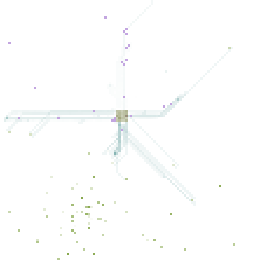

# Ant Colony Simulation (F#)

Demonstration of a simple path finding meta-heuristic, in the form of a colony of ants laying pheromone trails to pieces of food.

This example (from 2011) was used to demonstrate some of the features of F#, such as using algebraic data types (to define state automata) and asynchronous workflows (to execute multiple non-blocking simulations in parallel).

## Usage

The script `main.fsx` can be run with F# Interactive unaltered.

## License

Simplified BSD